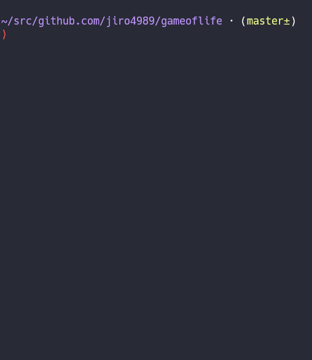

:toc: left
:sectnums:

= gameoflife

gameoflife is
https://en.wikipedia.org/wiki/Conway%27s_Game_of_Life[Game_of_Life] library in
pure Nim.

image:https://travis-ci.org/jiro4989/gameoflife.svg?branch=master["Build Status", link="https://travis-ci.org/jiro4989/gameoflife"]

== Development

- `nim >= 1.0.0`

== Install

[source,bash]
nimble install gameoflife

== Usage

=== CLI

[source,bash]
----
gameoflife examples/read_file/in/glider.txt
----

`glider.txt` is:

[source,txt]
----
00000000000000000000000000000000000000
00000000000000000000000001000000000000
00000000000000000000000101000000000000
00000000000001100000011000000000000110
00000000000010001000011000000000000110
01100000000100000100011000000000000000
01100000000100010110000101000000000000
00000000000100000100000001000000000000
00000000000010001000000000000000000000
00000000000001100000000000000000000000
00000000000000000000000000000000000000
00000000000000000000000000000000000000
00000000000000000000000000000000000000
00000000000000000000000000000000000000
00000000000000000000000000000000000000
00000000000000000000000000000000000000
00000000000000000000000000000000000000
00000000000000000000000000000000000000
----

==== Play gameoflife with `maze`

Generate random data with https://github.com/jiro4989/maze[maze].

Setup:

[source,bash]
----
nimble install -Y maze
----

And run:

[source,bash]
----
maze -r:1 -w:0 -W:20 -H:20 | gameoflife
----

=== Library

==== Blinker example

[source,nim]
----
import gameoflife
from os import sleep

var board: Board = @[
  @[dead, dead, dead, dead, dead],
  @[dead, dead, dead, dead, dead],
  @[dead, live, live, live, dead],
  @[dead, dead, dead, dead, dead],
  @[dead, dead, dead, dead, dead],
]

while true:
  board.nextStep()
  board.print
  echo "-----------------------------------"
  sleep(100)
----

==== Glider example

[source,bash]
cd examples/read_file
nim c -r main.nim in/glider.txt

image:docs/glider.gif["Glider animation"]

== Documents

* https://jiro4989.github.io/gameoflife/gameoflife.html

== Web application of Game of Life

I created simple Game of Life on web application.

https://jiro4989.github.io/gameoflife

Javascript library of Game of Life of the application is generated by this
module (`nimble js`).

